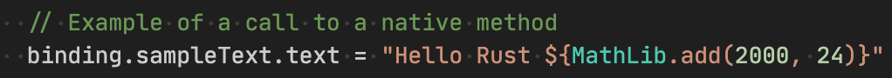

# Rust Cross-compilation Samples

Example shared library written in Rust:

```rust
// The shared function
pub fn add(left: i64, right: i64) -> i64 {
    left + right
}
```

Then the above code can be cross-compiled against different target platform and cpu architecture:

| Target OS | Code Snippets | Screenshot |
|------|------|---|
| Android |  |  |
| HarmonyOS NEXT | |  |
| iOS | | |
